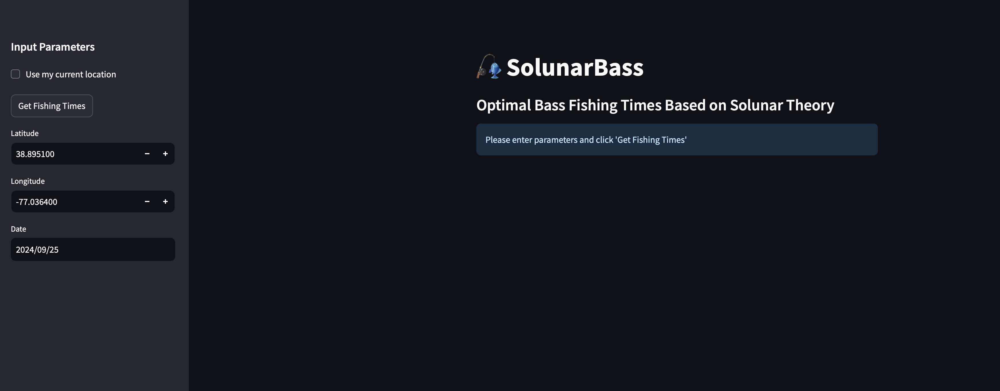

[](https://stats.uptimerobot.com/AQLeOzd84C)


# Solunar Bass Forecasting Tool 🎣



Welcome to **Solunar Bass**, an open-source project by **Bassfinity** that helps bass fishermen maximize their fishing success using solunar theory, data acquisition, and personalized recommendations. This repository powers a web app that predicts optimal bass fishing times based on solunar data, weather conditions, and location. You can view the website [here](https://solunarbass-h9jxdwh8usuzhpix2yessm.streamlit.app)

The project consists of several key components working together, from data acquisition to recommendations.

## Project Overview

This repository contains all the necessary components to run the Solunar Bass web application:

1. **app.py**: The main application file that integrates all functionalities and renders the Streamlit web interface.
2. **src/**: A directory containing all the modules:
   - **data_acquisition.py**: Handles fetching and processing external data (e.g., weather, solunar events) required for accurate predictions.
   - **data_processing.py**: Responsible for cleaning, transforming, and structuring data for analysis and display.
   - **solunar_calculations.py**: Provides utility functions for calculating solunar tables, lunar phases, and their impact on fishing activity.
   - **recommendation_engine.py**: Contains the logic to generate personalized fishing recommendations based on solunar data and user input.
3. **requirements.txt**: Lists all the Python dependencies needed to run the application.
4. **README.md**: Provides an overview and instructions for setting up the project.

The application is hosted via [Streamlit](https://streamlit.io/), allowing it to be easily deployed and accessed via the web.

## Features

- **Real-time Solunar Calculations**: Uses solunar theory to predict peak times for bass fishing.
- **Location-based Forecasts**: Enter your location or use your current geolocation to get localized fishing forecasts.
- **User-friendly Interface**: Built using Streamlit for an intuitive and visually appealing user experience.
- **Interactive Map**: Powered by Folium, showing your selected location.

## Getting Started

### Prerequisites

To run this application locally, you'll need:

- **Python 3.7 or higher**
- **pip** (Python package installer)
- The dependencies listed in the `requirements.txt` file

### Installation Instructions

#### **Step 1: Clone the Repository**

Open your terminal or command prompt and run:

```bash
git clone https://github.com/bassfinity/solunarbass.git
cd solunarbass
```

#### **Step 2: Create a Virtual Environment**

Creating a virtual environment is recommended to avoid conflicts with system-wide Python packages.

- **On macOS/Linux:**

  ```bash
  python3 -m venv venv
  ```

- **On Windows:**

  ```cmd
  python -m venv venv
  ```

#### **Step 3: Activate the Virtual Environment**

- **On macOS/Linux:**

  ```bash
  source venv/bin/activate
  ```

- **On Windows (Command Prompt):**

  ```cmd
  venv\Scripts\activate.bat
  ```

- **On Windows (PowerShell):**

  ```powershell
  venv\Scripts\Activate.ps1
  ```

  **Note**: If you encounter an error regarding script execution policies in PowerShell, you may need to adjust the execution policy:

  ```powershell
  Set-ExecutionPolicy -ExecutionPolicy RemoteSigned -Scope CurrentUser
  ```

#### **Step 4: Upgrade `pip`**

Ensure you have the latest version of `pip`:

```bash
python -m pip install --upgrade pip
```

#### **Step 5: Install the Required Dependencies**

Install the necessary Python libraries with the following command:

```bash
python -m pip install -r requirements.txt
```

#### **Step 6: Set Up the API Key**

The application requires an API key from [Visual Crossing Weather](https://www.visualcrossing.com/weather-api) to fetch weather and astronomical data.

**Follow these steps to set up your `API_KEY`:**

1. **Sign Up for an API Key**

   - Visit the [Visual Crossing Weather API](https://www.visualcrossing.com/weather-api) website.
   - Sign up for a free account to obtain your API key.

2. **Create a `config.toml` File**

   - In the root directory of the project (where `app.py` is located), create a file named `config.toml`.

     - **On macOS/Linux:**

       ```bash
       nano config.toml
       ```

     - **On Windows:**

       - Open a text editor (e.g., Notepad) and create a new file named `config.toml`.

   - Add the following content to `config.toml`, replacing `"your_visual_crossing_api_key"` with the API key you obtained:

     ```toml
     # config.toml
     API_KEY = "your_visual_crossing_api_key"
     ```

   - Save and close the file.

3. **Secure Your API Key**

   - **Important**: To prevent accidentally committing your API key to version control, add `config.toml` to your `.gitignore` file.

     ```bash
     echo "config.toml" >> .gitignore
     ```

#### **Step 7: Run the Application**

With all the setup complete, you can now run the application:

```bash
streamlit run app.py
```

This will launch the web app locally, and you can access it in your browser at `http://localhost:8501`.

---

## Important Notes

- **API Key Setup**:

  The application relies on the `API_KEY` provided in the `config.toml` file to fetch necessary data. Ensure that the `API_KEY` is correctly set up as per the instructions.

- **Virtual Environment**:

  Using a virtual environment isolates the project's dependencies, preventing conflicts with other Python projects or system-wide packages.

- **Dependencies**:

  The required Python packages are listed in the `requirements.txt` file:

  ```
  streamlit
  pandas
  numpy
  requests
  pytz
  streamlit-js-eval
  folium
  streamlit-folium
  toml
  ```

  **Note**: The `toml` library is required for reading the `config.toml` file.

---

## Code Overview

### **app.py**

This is the entry point for the web app. It ties together data acquisition, processing, solunar calculations, and the recommendation engine. The user interface is built with **Streamlit**, providing options to input location, select date, and display results.

### **src/data_acquisition.py**

This module handles fetching data from external APIs (e.g., weather data). It ensures that relevant data points, such as moon phases and weather conditions, are retrieved and prepared for processing.

- **Key Functions**:

  - `get_solunar_data(lat, lon, date)`: Fetches solunar and weather information for the specified location and date.

- **API Key Retrieval**:

  The `API_KEY` is retrieved from the `config.toml` file using a function that ensures the key is securely and consistently accessed.

### **src/data_processing.py**

This script processes the raw data obtained from the data acquisition step. It ensures data is clean, correctly formatted, and ready for analysis.

- **Key Functions**:

  - `process_solunar_data(data, date_str)`: Cleans and formats raw data for use in calculations.

### **src/solunar_calculations.py**

This module contains the logic to compute solunar events, such as major and minor feeding times, based on the moon's position.

- **Key Functions**:

  - `calculate_major_minor_times(solunar_data)`: Calculates major and minor periods for fishing activity.

### **src/recommendation_engine.py**

This module uses solunar theory to recommend the best times for bass fishing.

- **Key Functions**:

  - `generate_recommendations(major_times, minor_times)`: Generates personalized fishing recommendations.

---

## Contributing

Contributions are welcome! If you want to contribute to the project, follow these steps:

1. **Fork the repository**.

2. **Create a new branch** for your feature or bugfix.

3. **Make your changes** and ensure everything is tested.

4. **Open a pull request**, and we will review it.

---

## License

This project is licensed under the MIT License. See the [LICENSE](https://github.com/bassfinity/solunarbass/blob/main/LICENSE) file for details.

---

## Feedback & Support

For any questions or feedback, feel free to reach out to the **Bassfinity** team. You can also open an issue on the [GitHub repository](https://github.com/bassfinity/solunarbass/issues) or contact us via email at [info@bassfinity.com](mailto:info@bassfinity.com).

🎧 Join the SolunarBass Community on Discord

We now have a dedicated **#solunarbass** channel in the Bassfinity Discord server! Join our community to discuss solunar theory, share fishing experiences, and collaborate on improving the SolunarBass tool. Whether you're a developer, an angler, or both, we'd love to have you.

- **Discord Invite:** [Join our Discord](https://discord.gg/PZSSWcZy) and find us in the **#solunarbass** channel.

---

## Credits

Special thanks to [Visual Crossing](https://www.visualcrossing.com/weather-api) for providing the weather data used in this application. Their comprehensive and reliable weather API was essential in building the forecasting functionality for this project.

---

*Happy Fishing!* 🐟
